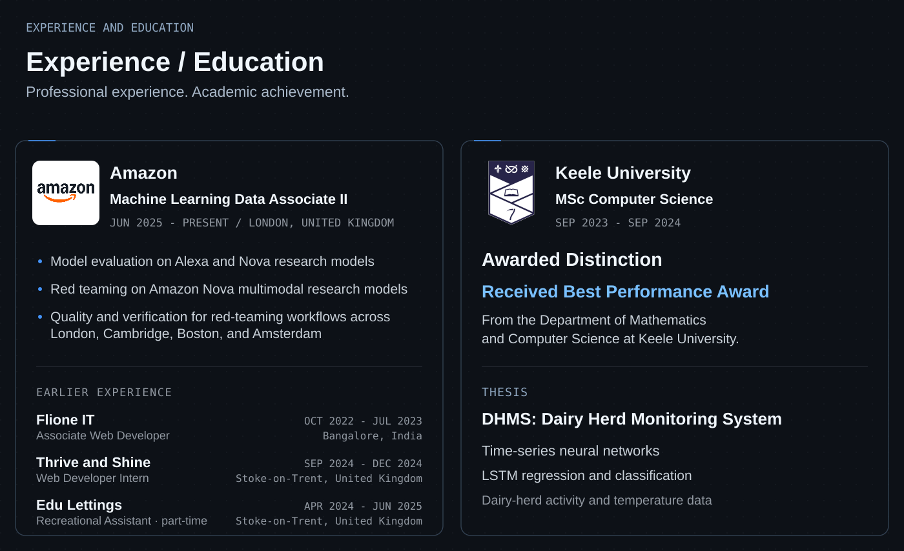
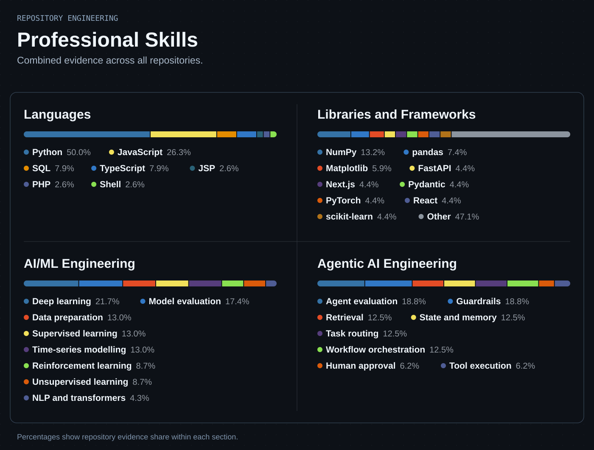

<picture>
  <source media="(max-width: 767px)" srcset="https://raw.githubusercontent.com/jyotheshkar/jyotheshkar/main/assets/profile-mobile.svg" />
  
</picture>

<picture>
  <source media="(max-width: 767px)" srcset="https://raw.githubusercontent.com/jyotheshkar/jyotheshkar/main/assets/career-mobile.svg" />
  
</picture>

<picture>
  <source media="(max-width: 767px)" srcset="https://raw.githubusercontent.com/jyotheshkar/jyotheshkar/main/assets/skills-mobile.svg" />
  
</picture>

[Skills evidence](docs/skill-circles.md) · [LinkedIn architecture](docs/linkedin-architecture.md)

